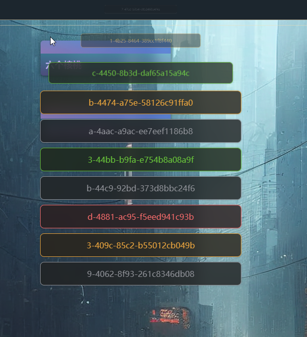

# PROJECT: web-components-test

> 实验小组 (**SIX WALNUTS**): **六个核桃**

## Features

- 基于原生 `WebComponent` 实现可拖拽编辑自定义卡片组件
  - 实现 css, 变量等属性隔离, 封装隐藏具体操作
  - 通过内部的生命周期函数实现听器的挂载和卸载自动配置
  - 利用代理实现部分属性监听/劫持
  - 组件内置性能监测配置, 可选的日志输出配置项
  - 选中状态下自动置顶显示
  - 自动检测容器边界, 防止拖拽移动越界
- 通过 `MutationObserver` 进行监听, 实时记录最新的数据, 并且通过防抖函数限制频繁写入 indexedDB
  - 配合 `WebWorker` 线程 以及 `IndexedDB` 实现最新的数据持久化存储, 解决采用 localStorage 读写时的阻塞问题
- 多种风格主题模式切换
- 自定义菜单组件(同样基于原生 WebComponent), 并拦截默认事件, 实现自定义功能
  - 添加
  - 编辑
  - 删除
  - 删除所有卡片
  - 导出卡片内文本
  - 打印页面
- 自定义 `CustomConfirm` 组件代替 `原生 confirm() 确认对话框`
  - 运行自定义设置标题
  - 基于 Promise 封装, 便于通过 then/catch 的方式获取值进行逻辑判断
    可以像这样子使用
    ```typescript
    const confirmDialog: CustomConfirm = new CustomConfirm();
    // 点击按钮重置主题
    const resetThemeButton: HTMLButtonElement = document.querySelector("#reset-theme")!;
    resetThemeButton.addEventListener("click", (): void => {
      confirmDialog
        .confirm("您确定恢复系统默认主题吗?")
        .then((): void => {
          useResetToDefaultTheme();
        })
        .catch((_reason): void => {});
    });
    ```
  - 自动移除监听器
- 使用 `typescript` 编写, 带来更加友好的类型系统和舒适的 IDE 代码提示
- 使用 sass(css 预处理器) 简化重复的样式编写
- 其它:
  - ~~花里胡哨但动画生硬的标语打字机效果~~
- 暂时就先这样...

## 简单的图片展示说明

- 为了限制文件大小, 帧率压得很低(所以看起来会很卡, 但实际并不会, 即使没用 transform)
  
- 节点稍微较多的情况下
  
- 自定义菜单(在卡片上时)
  
- 自定义菜单(在卡片外)
  
- 自定义确认框组件效果
  
- 自定义消息组件提示效果
  

## Notes

- 不支持 ~~全系列 IE~~ (您或许可以考虑 Polyfill)
- 项目使用 vite 进行配置开发, 这要求已安装 node(node >= 14) 和 vue-cli
  - 一切准备就绪
    ```sh
    cd web-components-test
    npm i
    npm run dev
    ```

## Project address

- [github link](https://github.com/Sorry-for-time/web-components-test)

## Browser Require

- Webkit:
  - Chromium
    - Chrome: last 4 version
  - Safari: the latest
- Gecko:
  - FireFox: last 4 version
- ...

## References

- [MDN](https://developer.mozilla.org/)
- [CAN I USE](https://caniuse.com/)
- [现代 JavaScript 教程](https://zh.javascript.info/)
