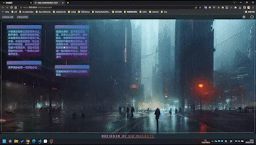
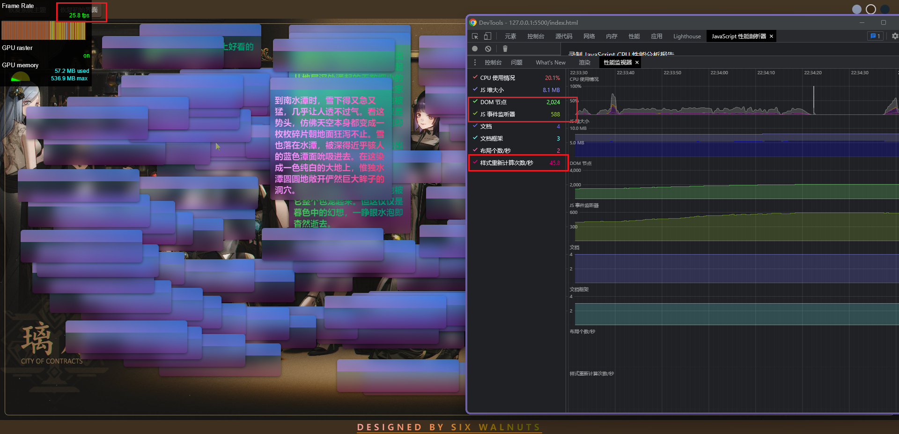
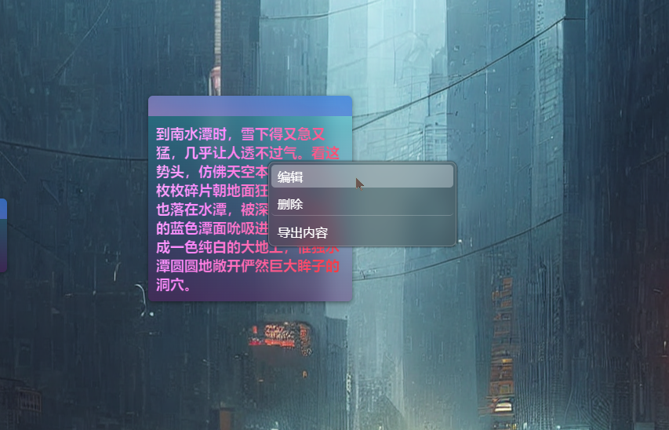
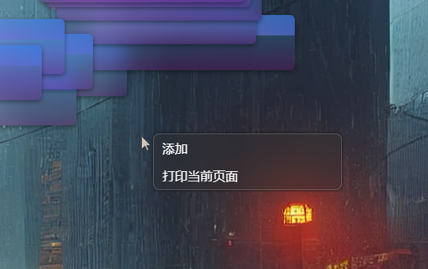
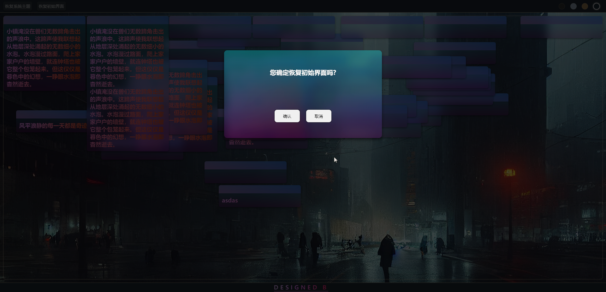

# PROJECT: web-components-test

> 实验小组 (**SIX WALNUTS**): **六个核桃**

## Features

- 基于原生 `WebComponent` 实现可拖拽编辑自定义卡片组件
  - 实现 css, 变量等属性隔离, 封装隐藏具体操作
  - 通过内部的生命周期函数实现听器的挂载和卸载自动配置
  - 利用代理实现部分属性监听/劫持
  - 组件内置性能监测配置, 可选的日志输出配置项
  - 选中状态下自动置顶显示
  - 自动检测容器边界, 防止拖拽移动越界
- 通过 `MutationObserver` 进行监听, 实时记录最新的数据, 并且通过防抖函数限制频繁写入 indexedDB
  - 配合 `WebWorker` 线程 以及 `IndexedDB` 实现最新的数据持久化存储, 解决采用 localStorage 读写时的阻塞问题
- 多种风格主题模式切换
- 自定义菜单组件(同样基于原生 WebComponent), 并拦截默认事件, 实现自定义功能
  - 添加
  - 编辑
  - 删除
  - 删除所有卡片
  - 导出卡片内文本
  - 打印页面
- 自定义 `Dialog` 组件替代 `confirm()`
- 使用 `typescript` 编写, 带来更加友好的类型系统和舒适的 IDE 代码提示
- 使用 sass(css 预处理器) 简化重复的样式编写
- 其它:
  - ~~花里胡哨但动画生硬的标语打字机效果~~
- 暂时就先这样...

## 简单的图片展示说明

> 为了限制文件大小, 帧率压得很低(所以看起来会很卡, 但实际并不会, 即使没用 transform)
> 
>
> 节点稍微较多的情况下
> 
>
> 自定义菜单(在卡片上时)
> 
>
> 自定义菜单(在卡片外)
> 
>
> 自定义确认框组件效果
> 

## Notes

- 不支持 ~~全系列 IE~~ (您或许可以考虑 Polyfill)
- 您需要使用 `tsc` 进行编译(是的, 这不是一个 webpack 或者 vite 等构建工具的项目)
  - 但项目已经设置好了 `tsconfig.json` 文件, 所以只需简单操作即可(这要求安装好了 node 环境和 typescript 模块)
    ```sh
    # 通过 zsh, bash, powershell, git-bash等 shell进入到项目根目录内(不要使用 cmd)
    cd web-components-test
    tsc -p ./tsconfig.json --watch
    ```
- 因为使用了 ES module 模块化系统, 所以需要一个 `dev server`, 比如 vscode 插件: `live server`
- 此外, 因为使用了 sass 来简化编写样式, 所以您可能还需要一个转译插件, 比如 vscode 下的: `Live Sass` 插件
- ~~当然, 最简单的方法是直接创建一个 vite 的 typescript 空项目里, npm 安装 sass 依赖, 代码拷贝过去, 直接 npm run dev~~

## Project address

- [github link](https://github.com/Sorry-for-time/web-components-test)

## Browser Require

- Webkit:
  - Chromium
    - Chrome: last 4 version
  - Safari: the latest
- Gecko:
  - FireFox: last 4 version
- ...

## References

- [MDN](https://developer.mozilla.org/)
- [CAN I USE](https://caniuse.com/)
- [现代 JavaScript 教程](https://zh.javascript.info/)
